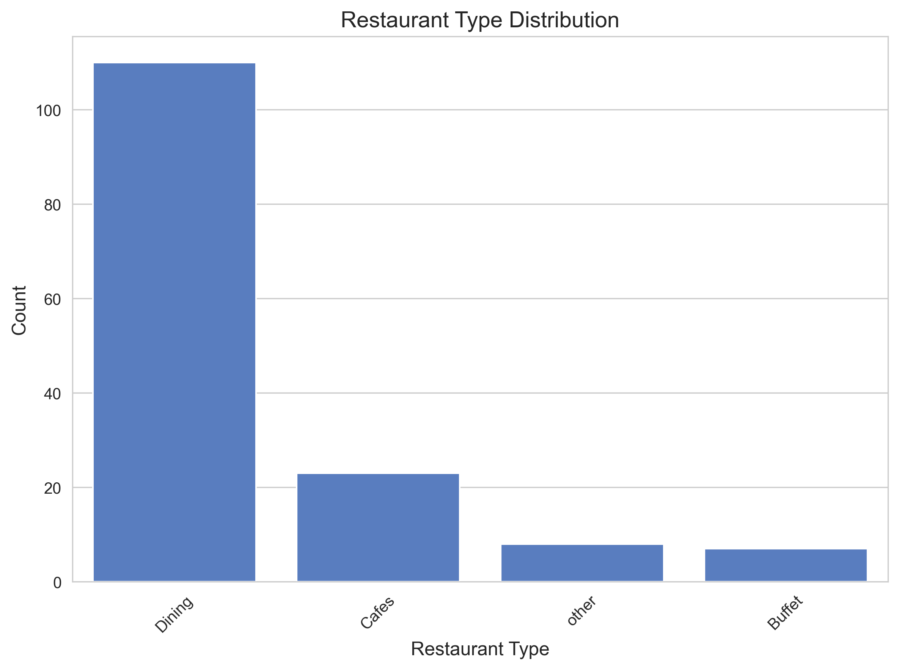

# Zomato Restaurant Data Analysis


## Overview
This project performs exploratory data analysis (EDA) on a Zomato restaurant dataset using Python. It analyzes restaurant ratings, votes, online order availability, and types, with visualizations and statistical insights.

## Features
- Data cleaning for ratings and costs
- Statistical analysis (t-test for ratings by online order)
- Visualizations (countplots, histograms, line plots)
- Optional interactive Plotly plots
- Command-line interface for flexibility

## Dataset
The dataset (`Zomato-data-.csv`) includes:
- Restaurant name
- Online order status
- Ratings
- Votes
- Approximate cost for two
- Restaurant type

*Note*: Place `Zomato-data-.csv` in the `data/` folder ( included in the repository).

## Setup
Install dependencies:
```bash
pip install pandas numpy matplotlib seaborn scipy plotly
```

## Usage
Run the analysis:
```bash
python zomato_analysis.py
```
For interactive plots or custom dataset path:
```bash
python zomato_analysis.py --file-path data/Zomato-data-.csv --interactive
```

## Visualizations
### Restaurant Type Distribution


### Votes by Restaurant Type


### Rating Distribution


## Project Structure
```
zomato-analysis/
├── data/                    # Dataset (not included)
├── plots/                   # Visualization outputs
├── zomato_analysis.py       # Main script
├── .gitignore               # Ignored files
├── README.md                # This file
├── LICENSE                  # MIT License
```

## License
MIT License - see [LICENSE](LICENSE) for details.

## Author
[Your Name] - [Your GitHub/LinkedIn Profile]
